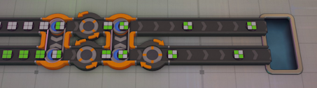
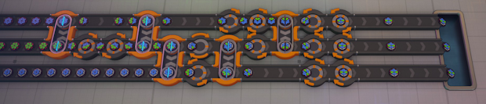

##  Introduction
This is a helper tool for players of [Shapez 2](https://shapez2.com/). The script helps to find a combination of rotators and swappers for building desired shapes from a specified initial set of shapes.

## Installation
The script does not require any installation, it can be run from any directory. However, it requires Perl interpreter. In most Linux distributions Perl comes preinstalled, but if it's not present, you can install it using your package manager. In Windows you need to download and install it separately. There are different variants available; I recommend [Strawberry Perl](https://strawberryperl.com/).

After you installed Perl (or unpacked the portable version), you will be able to run the script from command line terminal:
```
perl solver.pl ARGUMENTS
```
If you did not add Perl to the `PATH` environment variable, you will need to specify a full path to the Perl executable.

## Usage
The expected scenario goes like this: the player has several input belts that are running parallel to each other, and each belt carries only one type of shapes. The player wants to use them for building some different set of shapes. The available input and the desired output are passed to the script, and it will try to find the solution: a chain of rotator and swapper buildings that produces exactly that set of target shapes.

### Script input
The script runs with the following command line arguments:
```
perl solver.pl INPUT_SHAPES OUTPUT_SHAPES [MAX_SWAPPERS] [F]
```
- `INPUT_SHAPES` is a comma-delimited list of shapes supplied by each of the input belts.
- `OUTPUT_SHAPES` is a comma-delimited list of shapes expected to be received on the output belts.
- `MAX_SWAPPERS` is the maximum amount of swappers to try (6 by default).
- `F` is an optional flag that turns on the flat mode (explained below).

The shapes are passed in a format that's different from the in-game shape codes. You cannot just copy some `RuRuRuRu` from the game and give it to the script, it won't work. Instead, each quarter (or a hex part if you're in Hex mode) is written as a single letter. You can choose the letters arbitrarily, because for swappers it doens't matter whether it's a circle or a square, and whether it's painted or not. You just assign several letters for different types of the shape parts, and write them in the same order as in the game (starting with north-east and going clockwise). Also you can reuse identical letters for "garbage" parts that you don't care about (for example if you are going to trash the shapes made from those parts, so it doesn't matter how exactly they are built).

So, if you want to specify the shape `RuWuWuRu` you can use `a` for `Ru`, and `b` for `Wu`, and then the shape will look like `abba`. Or choose `r` and `w`, and then it will be `rwwr`. And for the Hex mode shape `FuFgHuHuGrHu` the format might look like `abccdc` (since there are 4 different types).

Note that you need to always specify all the input and output belts, even if some (or all) of the shapes are identical. See the examples below.

The command line argument `F` is used to restrict the search, and limit it to the solutions that have swappers only between the neighboring belts. By default the script has no such restrictions, and you may end up with a solution that wants you to add a swapper between the first and the third belt. To do that you'd have to somehow go across the second belt that's between them, which would require using floors or belt jumps. But this increases the size of the factory and may prevent you from duplicating the blueprint between floors. The flat mode guarantees that such configurations will never happen, but I cannot be sure if such a solution always exists.

### Script output
The output was designed to be as compact as possible, therefore it might look a bit cryptic. But don't worry, it's quite simple, really.

The found solutions are written as a sequence of "rotate+swap" operations, each being encoded by 4 digits: `nXmY`. `X` and `Y` here are the identifiers of the belts that need to be swapped; counting starts from 0 (0 is the first belt, 1 is the second belt, etc.). `n` and `m` are the amounts of single-step clockwise rotations that have to be applied to each of these belts before the swapper. For example, `3102` means: take the second belt (belt number 1), add to it 3 clockwise rotators (or, if you're in Quad mode, one counter-clockwise rotator); then take the third belt (number 2), do not add any rotators to it, and then add a swapper between these two belts.

The final operation is different. It's written in the form `rABC...` and indicates a rotation-only step that turns the built shapes to the correct orientation. `A`, `B`, `C`, etc. are the numbers showing the amount of clockwise rotations applied, respectively, to each of the belts. `A` is the rotation for the frist belt, `B` for the second, etc. When you implement the solution in the game, you can ignore the final rotation step if you don't care about the exact rotation (e.g. if this is the final step before entering the Vortex).

## Examples

### Checkerboard

Suppose we have two full rectangles of different color, and we want to build a diagonal mix. Let's say, our inputs are `RuRuRuRu` and `RgRgRgRg`, and we want to build two identical belts or `RuRgRuRg`. Let's use the letter `a` for the uncolored square quarter, and `b` for the green square quarter. Launching the script:
```
C:\Programs\shapes2-swapper-solver>perl solver.pl aaaa,bbbb abab,abab
Trying the amount of operations: 1...
  Time passed: 0s
  Configurations checked: 1
Trying the amount of operations: 2...
  0001,1011,r10
  0001,3031,r01
  Time passed: 0s
  Configurations checked: 16
  Solutions found: 2
```
The output tells us that it could not find the solution where only a single swapper is used, but there are two possible solutions that use two swappers. Let's take the second one and see what it does.

1. `0001`: This means we need to place a swapper between our two belts (which are numbered as 0 and 1). Each of them has zero rotations, so just a direct swap (which makes sense, because for such input shapes a rotation will not do anything, anyway).
2. `3031`: This tells us that first we need to rotate each of the belts 3 times clockwise (or one time counter-clockwise) and after that add the second swapper.
3. `r01`: And with this final step we leave the first belt as it is, and rotate the second belt once clockwise.

And if we now implement this scheme in the game, it will look like this (click the image for full size):

[](doc/example-checkerboard.png)

### Hexagon OL-1

Let's take a more complex scenario. We want to build the first Operator Level shape in Hex mode which looks like this: `GbHrHuHuHrGb:--FgGbGbFg--`. This is a double-layer shape, but we don't bother about it, because swappers work with all the layers simultaneously, and treat the whole vertical stack as a single piece (yes, there are some exceptions to that rule, but in this example they do not apply). If we take a closer look at the shape we'll notice that it has only 3 different types of "stacks": a single-layer blue gear; a green flower on top of a red hexagon; and another blue gear on top of an uncolored hexagon. Let's suppose we already have full shapes built from those constituent parts: `GbGbGbGbGbGb`, `HrHrHrHrHrHr:FgFgFgFgFgFg`, and `HuHuHuHuHuHu:GbGbGbGbGbGb`. Let's see if we can build the Operator Level shape from them. As usual, mark each part with a unique letter, and run the script:
```
C:\Programs\shapes2-swapper-solver>perl solver.pl aaaaaa,bbbbbb,cccccc abccba,abccba,abccba
Trying the amount of operations: 1...
  Time passed: 0s
  Configurations checked: 3
Trying the amount of operations: 2...
  Time passed: 0s
  Configurations checked: 144
Trying the amount of operations: 3...
  Time passed: 0s
  Configurations checked: 8.406
Trying the amount of operations: 4...
  Time passed: 6s
  Configurations checked: 676.404
Trying the amount of operations: 5...
  0001,0021,0102,0122,2022,r452
  0001,0021,0102,0122,5052,r551
  < ...skipped... >
  0102,5132,0042,4002,1051,r511
  0102,5132,0042,4002,4021,r421
  Time passed: 9m:12
  Configurations checked: 64.248.804
  Solutions found: 3712
```
Let's take a look at the first solution: `0001,0021,0102,0122,2022,r452`. The last swap operation here is performed between the first and the third belts (0 and 2). This is exactly what was described earlier, and usually such swaps between non-adjacent belts are to be avoided. We could look through the other solutions that the script found, and see if there is something better. But instead we can just run the script in "flat mode" by adding the argument `f`, and it will automatically exclude all the solutions that have "bad" swap operations:
```
C:\Programs\shapes2-swapper-solver>perl solver.pl aaaaaa,bbbbbb,cccccc abccba,abccba,abccba f
  < ...skipped... >
Trying the amount of operations: 5...
  0001,0021,0102,3152,2051,r422
  0001,0021,0102,3152,5021,r512
  < ...skipped... >
  0102,5112,0051,1031,1132,r442
  0102,5112,0051,1031,4102,r451
  Time passed: 1m:22
  Configurations checked: 9.647.744
  Solutions found: 296
```
Now the first found solution is `0001,0021,0102,3152,2051,r422`, and we can see that it indeed does not have any jumps across the belts. The in-game implementation would looks like this (again, the image is clickable):

[](doc/example-hex-ol1.png)

As we can see, it does produce the shape we wanted.

## Known issues
- The implementation does not take into account most of the advanced game mechanics. All the solutions imply that every swap operation leaves the pieces intact. In the actual game this is not always the case. In paritular:
  - If a cut half contains an unsupported layer, it will fall down under gravity.
  - When a crystal is cut across, it breaks, destroying all the connected crystals.
  - If a crystal falls down because of the gravity, it will also be destroyed.

  From the script's point of view, none of this ever happens. You need to control these behavior aspects by yourselves.
- Empty spots (gaps) are not fully supported. You can still use the solver for non-full shapes, but you need to assign a letter for the gaps like it's just another part. Generally it works fine. The only exception I know of, is when some intermediate step produces a fully empty shape that is expected to be swapped with something else later. It will not work, because the swappers cannot take an empty shape as one of the inputs; they just stop and wait indefinitely. However, an empty shape can be one of the final outputs without disrupting the production.
- Since the script uses brute force, trying all possible combinations, it can take a very long time for complex configurations. Run time grows exponentially with the amount of steps and the amount of belts. Finding a 6-swapper solution might take hours or even days. Sometimes it's wiser to reconsider your options, or split the production line into several smaller steps.
- The consistency checking is a bit rudimentary. The script will check for most obvious mistakes, such as inequality of the total amount of different pieces in the input and output belts. But some impossible configurations might still happen, and the script will just spend time looking for a solution that could never exist.
- All the solutions are printed as soon as they are found. On the one hand it helps to reduce the waiting time; you're receiving the solutions as quickly as possible. On the other hand, some building chains can be more preferable than others. For example, in hex mode some solutions may have 2-step or 4-step rotations, that can only be implemented with a sequence of 2 rotators. But there may also be other solutions that use only 1, 3, and 5-step rotations, each of which can be implemented by a single rotator, so the resulting factory would be more compact. Also, in some scenarios a rotator can be placed within an unoccupied stretch of belt, thus decreasing the total length of the chain compared to some of the other variants. The script gives no preference, and just prints the solutions in the order they were found.
